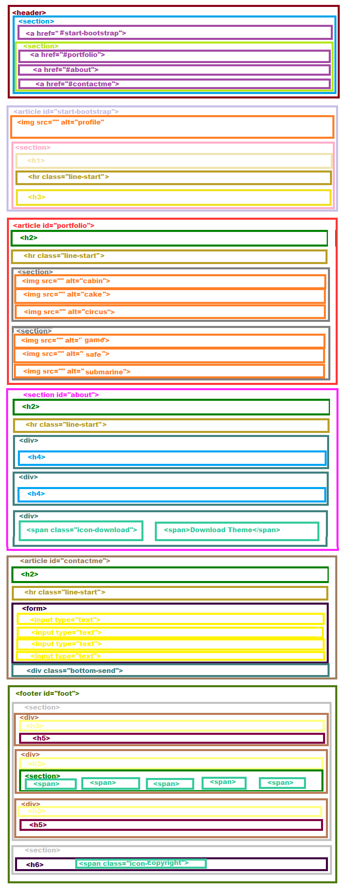

# Freelancer

* **Track:** _Common Core_
* **Curso:** _Creando tu primer sitio web interactivo_
* **Unidad:** _Maquetado web con HTML & CSS_

***
# Previo al código
1. Realizar un [**fork**](https://gist.github.com/ivandevp/1de47ae69a5e139a6622d78c882e1f74)
   de este repositorio.

2. En git bash se ejecuto clonar **clonar** el fork en mi máquina. El comando usado es `git clone` y su estructura normalmente se ve así:

   ```bash
   git clone https://github.com/<nombre-de-usuario>/freelancer.git
   ```

# Estructura del body.
 * Estructura y orden de las etiquetas anidadas dentro del body.


